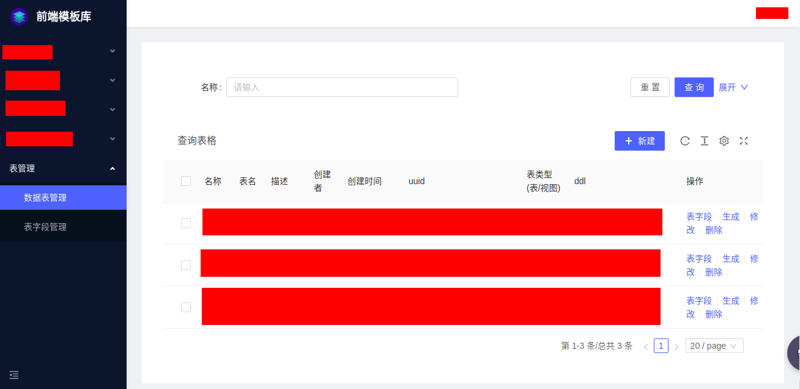
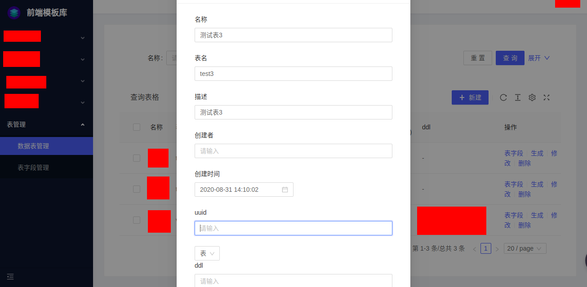
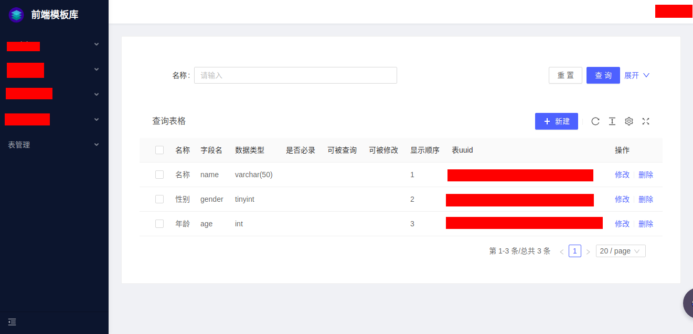
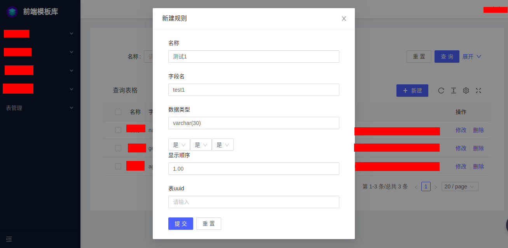

创建表
=========
起步中只是创建了您自己的前端页面，使用了网站提供的demo数据，您可以通过该文档实现后台表结构的自定义。

### 一、创建表
#### 1.进入表管理页面
通过应用左侧菜单的“表管理->数据表管理”，进入表管理页面。


#### 2.新建表
点击“新建”，填写表信息，新建一个表。


### 二、编辑表字段
点击刚刚新建的表右侧的“表字段”跳转至“表字段管理”，点击“新建”，添加一个字段。
  



### 三、生成表
所有字段添加完成后回到“数据表管理”页面，点击表信息右侧的“生成”，生成数据表。

***
生成后即可通过REST接口访问该表，接口地址如下
```
/api/custom-table/[uuid]
```
可以新建一个单表增删改查来测试表接口，创建页面请参考[起步](./起步.html)
