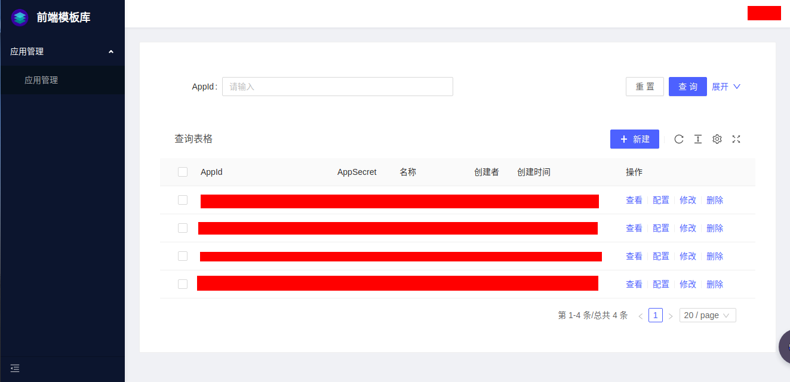
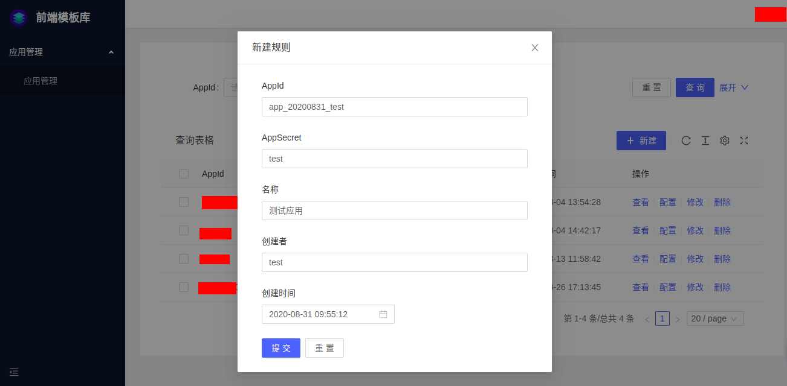
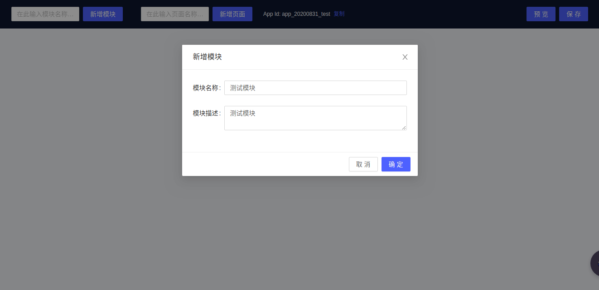
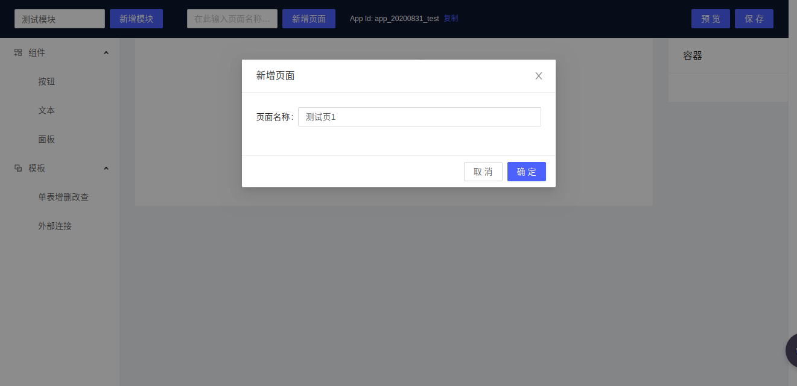
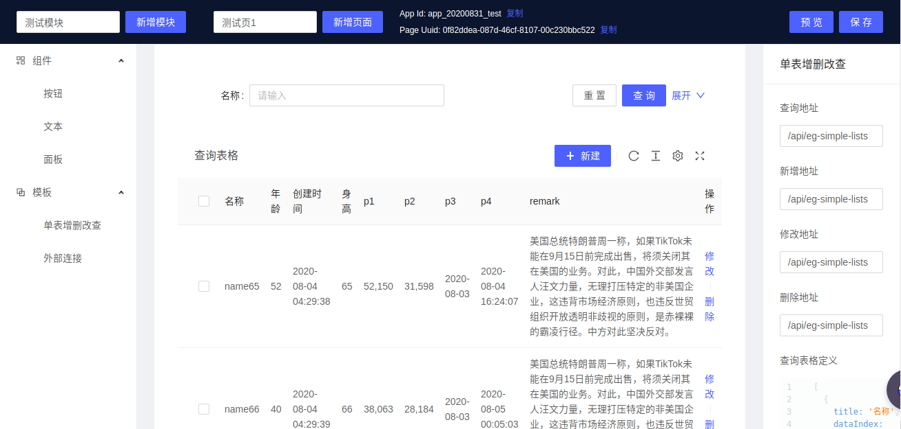
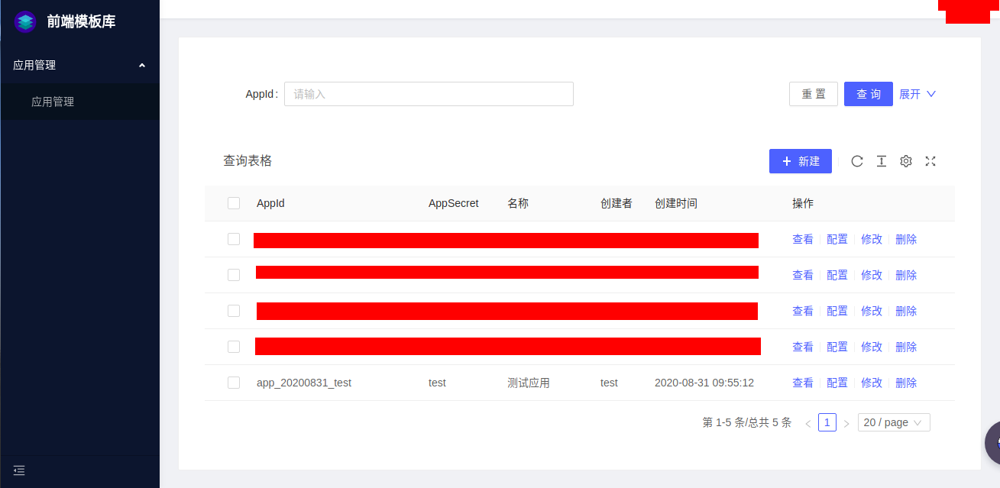
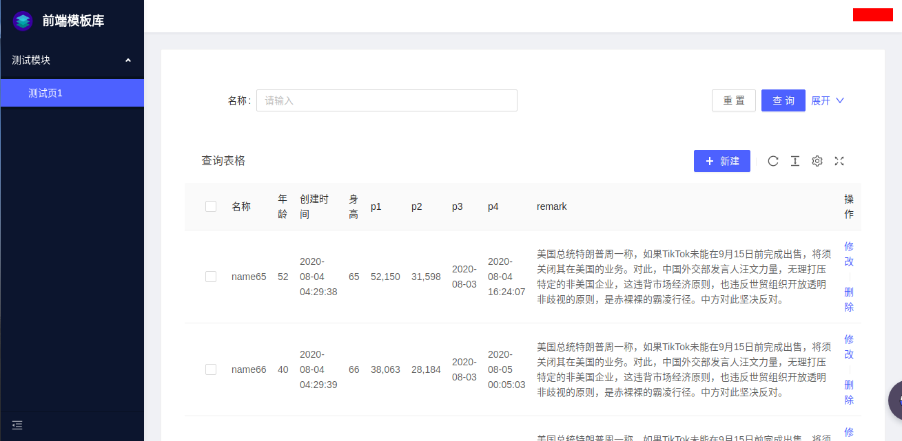

起步
======
模板库是一个可以让用户以便捷的方式创建、管理、编辑页面的服务，下面的文档会带您体验亲手创建一个简单的应用。

## 一、创建应用
### 1.访问管理页面
登录地址：
```
http://test.pageditor.com
```

登录成功后会自动跳转至应用管理页面。


### 2.添加应用
点击“新建”按钮，输入应用信息添加一个应用。  


## 二、编辑应用
### 1.打开编辑界面
在应用管理页面，点击应用信息右侧的“配置”按钮，访问应用编辑页面。  


### 2.添加模块
点击上方的“添加模块”按钮，填写模块信息，新建一个模块。  

模块会以菜单的方式展示在页面上，每个模块的页面即是子菜单。

### 3.添加页面
点击“添加页面”，填写页面信息。  


### 4.编辑页面
可以将左侧菜单中的组件拖入页面中，点选页面中的组件可以对组件进行配置。  


### 5.保存页面
点击右上角保存按钮保存已编辑完成的页面。

## 三、访问页面
回到登陆后的管理页面，点击右侧的查看，即可跳转到刚刚编辑的应用。  
  

  

***
到此，您已成功用模板库创建了一个简单的应用。
